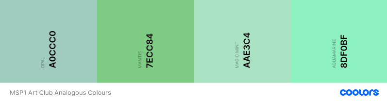

- [Art Club](#art-club)
  * [UX](#ux)
    + [Strategy](#strategy)
    + [Scope](#scope)
    + [Structure](#structure)
    + [Skeleton](#skeleton)
      - [Wireframes](#wireframes)
    + [Surface](#surface)
      - [Analogous Colour Palette](#analogous-colour-palette)
  * [Features](#features)
    + [Existing Features](#existing-features)
    + [Features Left to Implement](#features-left-to-implement)
  * [Technologies Used](#technologies-used)
  * [Testing](#testing)
    + [Peer reviews](#peer-reviews)
  * [Deployment](#deployment)
  * [Credits](#credits)
    + [Content](#content)
    + [Media](#media)
    + [Acknowledgements](#acknowledgements)

<small><i><a href='http://ecotrust-canada.github.io/markdown-toc/'>Table of contents generated with markdown-toc</a></i></small>

# Art Club
A web site designed for the local art community.
A place to connect, share news and views, meet-ups.
The site will also act as a repository for 'how-to' articles of interest to members.
The site will eventually aid the organisation of an annual exhibition for members.

## UX
 
User Stories:
- As a curious browser, possibly finding site from Google Search, I want to find out what this site is for.
- As a viewer of the site would like to see planned activities and exhibits run by the art club.
- As an interested art viewer, would like to see examples of artists work.

- As an amateur artist or hobbyist, interested in joining fellow practisioners, would like to join as a member.
- As a practising artist would like to see opportunities to exhibit my art or tutor fellow artists.

### Strategy

To provide an accessible site for the club's work and introduction to it's members, so that further members will be attracted.

### Scope

By the nature of visual arts the site will be mainly image based, with displays of member's works and images of activities.
There will be a form for membership application available.

### Structure

Image information, member information linked to image of works.
Images for exhibitions will be located in an image directory specified by the exhibition's year.
Any images associated with activities will be located in a separate directory for activities.
Membership application will need details of forename,surname,contact number, email, and whether the applicant wishes to exhibit.

### Skeleton

The home page will show the main attractions, a selection of the member's work to view.

There will be navigation to other pages on the site from the header. 
Depending upon responsiveness, the navigation will be via a 'hamburger' menu for smaller viewports, or an inline row of labeled buttons.
This navigation will be mirrored for each page of the site.

A brief introduction imparting the nature of the get-togethers of the club, culminating in the club's summer exhibition of works to show the general public.

An exhibition page will show the previous year's exhibition highlights, whether the works themselves or the personalities involved. This could be updated with images of submissions for the up coming exhibition to spur other to join/participate.

A separate page of activities run by the club will give a timeline of dates, times, places and brief titles of activities that the members and public can attend.

An application for membership page will prompt for the relevant information, such as name, contact number and email, maybe reason to join.

Images will be organised into directories:
- the icon image for the club will remain in the assets/images subdirectory.
- exhibition images for each year in their own subdirectory of assets/images.
- images associated with publicised activities will be contained in separate subdirectory of assets/images.
- main [index.html] page will display images from 'promo' subdirectory of assets/images.

#### Wireframes 

Public link to wireframes used as mockups : [balsamiq](https://balsamiq.cloud/sdh3q7g/pswpdsk)

Alternatively a PDF document of the wireframes is included (
https://github.com/mikedjgreen/MSP1_art_club/blob/63dd1f806214f374906c85206393260ab001286e/assets/docs/Wireframe%20Art%20Club.pdf ).

### Surface

The header and footer background colours for all pages will be a uniform colour that helps identify the site.
A light blue, identified as: #d9e6f3.

Upon feedback the menu colours were restricted to shades of green:
- Home : #A0CCC0  Opal
- Activity :  #7ECC84   Mantis
- Exhibition : #AAE3C4 Magic Mint
- Join Us : #8DF0BF   Aquamarine

#### Analogous Colour Palette

The font will be Roboto with a back-up of Arial.

## Features

 
### Existing Features

- Bootstrap Image carousel used to show members' selected art work found on the home page [index.html]
- Activities timeline detailing each date,time and location of a club organised activity found on activities page [activities.html]
- Bootstrap Image Carousel showing either last summer's exhibition highlights, or forthcoming exhibition submissions [exhibition.html]
- Bootstrap form component used for membership application to club [joinus.html]

### Features Left to Implement

- Membership form to be linked to a back-end database of members and their membership dues.
- An administrators page that can easily access and query the back-end member list, access to the page being password protected.
- An image repository that can be searched on keyword, title and creator name.
- An ability to pass comments, 'critiques', of members work.

## Technologies Used

In this section, you should mention all of the languages, frameworks, libraries, 
and any other tools that you have used to construct this project. 
For each, provide its name, a link to its official site and a short sentence of why it was used.

- [Bootstrap](https://getbootstrap.com/) to provide a mobile-first framework for the site.
- [Font Awesome](https://fontawesome.com/) to provide additional icons
- [Hover](http://ianlunn.github.io/Hover/) to provide hover effects to enhance user experience

- [TOC for markdown](https://ecotrust-canada.github.io/markdown-toc/) to generate table of contents for README
- [Colour Palette](https://coolors.co/a0ccc0-7ecc84-aae3c4) to select colour palette for menus and backgrounds.

## Testing

For the sake of brevity, see separate link for testing procedures :
[Testing](assets/docs/TESTING.md)

HTML Validated:
* https://validator.w3.org/nu/?doc=https://mikedjgreen.github.io/MSP1_art_club/index.html
* https://validator.w3.org/nu/?doc=https://mikedjgreen.github.io/MSP1_art_club/activities.html
* https://validator.w3.org/nu/?doc=https://mikedjgreen.github.io/MSP1_art_club/exhibition.html
* https://validator.w3.org/nu/?doc=https://mikedjgreen.github.io/MSP1_art_club/joinus.html

CSS Validated:

### Peer reviews
* reduce menu colours. Using coolors colour selection app: https://coolors.co/ffffff-674f83-d19c1d-1496bb-993366
* background image repeating on index page, conflicting with text.
* add gutter on desktop viewport, never wider than 1200 pixel (xl).
* vertical spacing is tight : https://getbootstrap.com/docs/4.0/utilities/spacing/
* 404 error on css path to art club log image - amended
* Call to action at the top of the main page...'Join Us!' button.
* Footer social media badges too small, so enlarged (fa-lg).

## Deployment

Developed on GitPod using git and GitHub.
Selected Repository : mikedjgreen/MSP1_art_club
Generated from: https://github.com/Code-Institute-Org/gitpod-full-template

Deployment steps:
- opened up GitHub
- signed in
- selected repository mikedjgreen/MSP1_art_club
- navigated to repository
- selected 'settings'
- scrolled to GitHub pages area
- selected 'Master Branch' from the source drop down menu
- confirmed selected
Now live on GitHub pages.

To run this code on your local machine, you would go to my respository at https://github.com/mikedjgreen/MSP1_art_club and on the home page on the right hand side just above all the files, you will see a green button that says, "Clone or download", this button will give you options to clone with HTTPS, open in desktop or download as a zip file.
To continue with cloning, you would:
- Open Git Bash
- Change the current working directory to the location where you want the cloned directory to be made.
- Type git clone, and then paste this URL: https://github.com/mikedjgreen/MSP1_art_club.git Press Enter. Your local clone will be created.

For more information about the above process; https://help.github.com/en/github/creating-cloning-and-archiving-repositories/cloning-a-repository

The project is built to a master branch deployed to: https://mikedjgreen.github.io/MSP1_art_club/ .
There is no separate git branch.

## Credits

### Content
- The text written by author.
- The carousels taken directly from bootstraps components. https://getbootstrap.com/

### Media
- The photos used in this site were obtained from the author (in jpeg format) as examples of the images required.
- Font Awesome for aeroplane icon and social media icons:[Font Awesome](https://fontawesome.com/)

### Acknowledgements

- I received inspiration for this project from [Ely Art Society](https://www.elyartsociety.com/)
- Code Institute's Slack Channels and the many alunni, mentors, tutors and users who contribute to them. Especially @Malia who peer reviewed my project.
