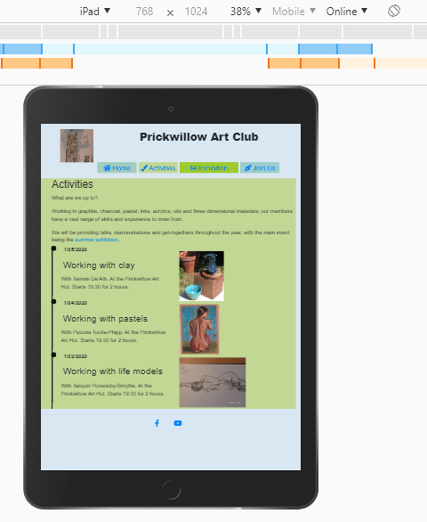

## Testing

1. Open the site and read introduction informing viewer of purpose of web site. 
Easily navigate from initial page to pages on club activities, summer exhibition details and membership application.

2. Further links followed to get dates and times of art club activities throughout the year, or season.

3. Follow link to view this season's summer exhibition organised by the club, dates, times and venue. Displayed images of submitted works for exhibtion.

4. Join us form:
    1. Go to the "Join Us" page
    
    2. Try to submit the empty form and verify that an error: '! Please fill out this field', about the required fields appears  
    3. Try to submit the form with an invalid email address and verify that a relevant error message appears, '! Please include an '@' in the email address.' 
    
    
      
    
    4. Try to submit the form with all inputs valid and verify that a success message appears.

No success message as no valid action on submit. Method will be "POST" as there is personal information.

Testing different screen sizes:
| Chrome's Inspect emulator           | width  | breakpoint |
|-------------------------------------|--------|------------|
| Nokia Lumia                         | 320px  | (default)  |
| Nexus 7                             | 600px  | sm         |
| iPad :                              | 768px  | sm/md      |
| Kindle Fire:                        | 800px  | md         |
| iPad Pro:                           | 1024px | lg         |
| Laptop with MDPI screen             | 1280px | xl         |

Had a separate Kindle Fire to see responsiveness on all pages of changes from landscape to portrait views.
Landscape had button link navigation whilst portrait had 'hamburger' menu drop downs.
